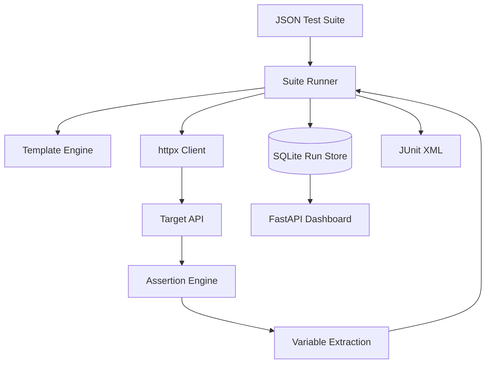

# Architecture

The orchestration engine is independent of FastAPI. That allows the same runner to be used by the CLI, REST service, unit tests, or a future CI plugin.

Independent suites can execute concurrently while cases within a suite remain ordered so extracted variables are deterministic.
